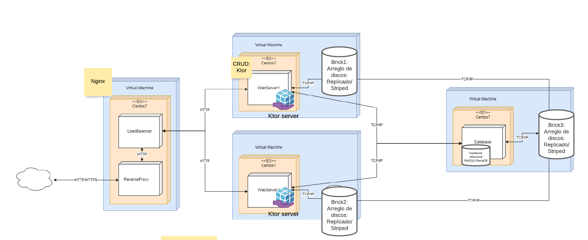
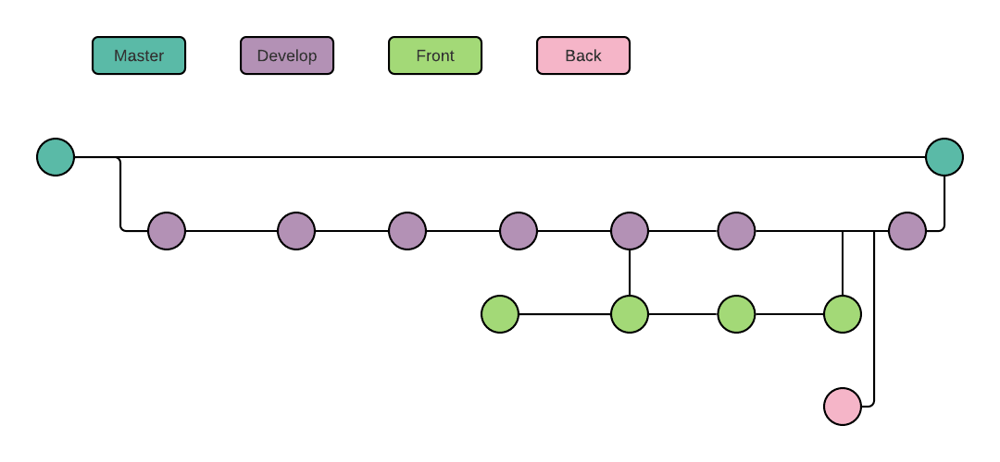

# DOCUMENTATION OF ICESI HEALTH

Authors:

- Santiago Chasqui Córdoba    - A00347050
- Nicolás Javier Salazar      - A00348466
- Sebastian Rebolledo Meneses - A00310476
- Paola Veloza Naranjo        - A00349107

___

## THE SYSTEM

In the figure  1 we show the network infraestructure for this system.


**Figure 1.** -  System architecture

## General Information

The following information specifies name of machine, it's description, ip address, and operating system 

```textile
lb    : Loandbalancer    | ip: 192.168.33.200 | os: centos 7
web-1 : web server one   | ip: 192.168.33.11  | os: centos 7
web-2 : web server two   | ip: 192.168.33.12  | os: centos 7
db    : Data base server | ip: 192.168.33.100 | os: centos 7
```

## Loadbalancer

#### Vagrantfile

Firts we create the Loandbalancer with vagrant

```ruby
  config.vm.define 'lb' do |lb|
    lb.vm.box = 'centos/7'
    lb.vm.hostname = 'sistemasdistribuidos'
    lb.vm.network 'private_network', ip: '192.168.33.200'
    lb.vm.provider 'virtualbox' do |vb|
      vb.customize ['modifyvm', :id, '--memory', '512', '--cpus', '1', '--name', 'lb']
    end
    lb.vm.provision 'ansible' do |ansible|
      ansible.playbook = 'playbooks/nginx/main.yml'
    end
  end
```

This machine was configured, with ansible in the file `playbooks/nginx/main.yml`, this file we install openssl and dependencies, see bellow 

```yaml
[...]
  pre_tasks:
    - name: Ensure epel repository exists
      yum: name=epel-release
    - name: Install openssl dependencies
      yum: 
        name:
          - openssl-devel
    - name: Turn on firewalld
      service: name=firewalld state=started enabled=yes
    - name: install pip
      yum: name=python-pip state=latest
    - name: upgrade pip
      shell: pip install --upgrade "pip < 21.0"
    - name: Install pip3 depden
      pip:
        name: pyopenssl
[...]
```

In the same file we call the task to make the self certifificated in: `playbooks/nginx/tasks/self-signed-cert.yml`

```yaml
---
- name: Ensure directory exists for self-signed certs
  file:
    path: "{{ certificate_dir }}/{{ server_hostname }}"
    state: directory

- name: Generate Private key
  openssl_privatekey:
    path: "{{ certificate_dir }}/{{server_hostname}}/privkey.pem"
- name: Generate CSR
  openssl_csr:
    path: "{{ certificate_dir}}/{{server_hostname}}.csr"
    privatekey_path: "{{certificate_dir}}/{{server_hostname}}/privkey.pem"
    common_name: "{{ server_hostname }}"

- name: Generate self signeed certificate
  openssl_certificate:
    path: "{{certificate_dir}}/{{server_hostname}}/fullchain.pem"
    privatekey_path: "{{ certificate_dir}}/{{server_hostname}}/privkey.pem"
    csr_path: "{{certificate_dir}}/{{server_hostname}}.csr"
    provider: selfsigned
```

Then we install Nginx and copy configuration from `playbooks/nginx/templates/nginx.conf.j2`, this config redirect http trafic to https trafic, and (of course) configure the loadbalancer between webservers (by default the nginx use round‑robin algorith). We show in more details this configuration bellow.

```yaml
  [...]
  tasks:
    - import_tasks: tasks/self-signed-cert.yml
    - name: Install nginx 
      yum:
        name:
          - nginx
    - name: Enable firewall
      shell: "firewall-cmd --permanent --add-service={http,https}"
    - name: Firewall rule
      shell: "firewall-cmd --zone=public --add-port=8083/tcp"
    - name: Start firewall rule
      shell: "firewall-cmd --reload"
    - name: Ensure docroot exists
      file:
        path: "{{nginx_docroot}}"
        state: directory
    - name: Nginx configuration server
      template:
        src: templates/nginx.conf.j2
        dest: /etc/nginx/nginx.conf
        mode: 0644
    - name: Restart nginx
      service: name=nginx state=restarted enabled=yes
    - name: COnfigure SO to allow to nginx make the proxyredirect
      shell: setsebool httpd_can_network_connect on -P
```

The file `playbooks/nginx/tamplates/nginx.conf.j2` has the configurations to loadbalancer. The [upstream module](https://nginx.org/en/docs/http/ngx_http_upstream_module.html) in nginx is used to specifie the group of web servers.

```jinja2
events {
   worker_connections    1024;
}

http {
   include    mime.types;
   default_type    application/octet-stream;
   keepalive_timeout    65;

    upstream web {
        server 192.168.33.11:80;
        server 192.168.33.12:80;
    }
}
[...]
```

This part of the configuration redirect the trafict from http (network trafict from the port 80) to the https protocol. This configuration file is also responsible of making the proxy configuration (to redirect from loadbalancer to webservers) and ssl encryption/decryption, to this tasks, we used the [ssl module](https://nginx.org/en/docs/http/ngx_http_ssl_module.html) and  [reverse proxy module](https://nginx.org/en/docs/http/ngx_http_proxy_module.html).

```jinja2
   [...]
   erver {
        listen 80 default_server;
        server_name _;
        index index.html;
        return 301 https://$host$request_uri;
    }

    server {
        listen 443 ssl default_server;
        server_name {{ server_hostname }};
        add_header Access-Control-Allow-Origin *;
        add_header Access-Control-Allow-Methods "GET,HEAD,PUT,PATCH,POST,DELETE";

        location / {
            proxy_set_header Host $http_host;
            proxy_set_header X-Real-IP $remote_addr;
            proxy_set_header X-Forwarded-For $proxy_add_x_forwarded_for;
            proxy_set_header X-Forwarded-Proto $scheme;
            proxy_pass          http://web;
            proxy_read_timeout  90s;
            proxy_redirect      http://web {{ server_hostname }};
        }

        ssl_certificate {{ certificate_dir }}/{{ server_hostname }}/fullchain.pem;
        ssl_certificate_key {{ certificate_dir }}/{{ server_hostname }}/privkey.pem;
    }
```

**NOTE:** the ansible variables for this configs are in the file: `playbooks/nginx/vars/main.yml` see content to it bellow: 

```yaml
certificate_dir: /etc/ssl/private
server_hostname: sistemasdistribuidos
nginx_docroot: /usr/share/nginx/html
pip_install_packages: ['pyopenssl']
```

## Web Servers

Second we configure two web servers with vagrant, see bellow

```ruby
  config.ssh.insert_key = false
  (1..2).each do |i|
    config.vm.define "web-#{i}" do |web|
      web.vm.box = 'centos/7'
      web.vm.hostname = "web-#{i}"
      web.vm.network 'private_network', ip: "192.168.33.1#{i}"
      web.vm.provider 'virtualbox' do |vb|
        vb.customize ['modifyvm', :id, '--memory', '512', '--cpus',
                      '1', '--name', "web-#{i}"]
        unless File.exist?("./brick#{i}.vdi")
          vb.customize ['createhd', '--filename', "./brick#{i}.vdi",
                        '--variant', 'Fixed', '--size', 2 * 1024]
        end
        vb.customize ['storageattach', :id, '--storagectl', 'IDE',
                      '--port', 1, '--device', 0, '--type', 'hdd',
                      '--medium', "./brick#{i}.vdi"]
      end
      # do configuration ...
      web.vm.provision 'ansible' do |ansible|
        ansible.playbook = 'playbooks/http/main.yml'
        ansible.groups = {
          'webservers' => ["web-#{i}"]
        }
      end
    end
  end
```

this machines are configure (again) with ansible with the file: `playbooks/http/main.yml` in this file we install, the java jre and java jdk, to run the Ktor server

```yaml
---
- hosts: webservers
  become: true
  vars_files:
    - vars/main.yml
    - ../glusterfs/vars/main.yml
  vars:
    variable: "print_hostname"
  pre_tasks:
    - name: Install Ktor dependencies
      yum:
        name:
          - epel-release
          - java-1.8.0-openjdk
          - java-1.8.0-openjdk-devel
[...]
```

Also in this file we install nginx, we copy the nginx configuration from `playbooks/http/templates/nginx.conf.j2`, as well in this file, we copy and run the jar  file that execute the Ktor backend (the code of this backed is in [this repository](https://github.com/SChasqui/icesi-health)), together with the file call the task to install glusterfs (we talk about this in more detail later)

```yaml
[...]
    tasks:
    - import_tasks: ../glusterfs/glusterfs-config.yml
    - name: Install Nginx
      yum:
        name:
          - nginx
    - name: Ensure docroot exists
      file:
        path: "{{nginx_docroot}}"
        state: directory
    - name: Copy html file
      copy:
        src: templates/index.j2
        dest: "{{nginx_docroot}}/index.html"
        mode: 0755
    - name: Copy backend 
      copy:
        src: files/icesi-health-0.0.1.jar
        dest: /home/vagrant/icesi-health.jar
        mode: 0755
    - name: Ensure docroot exists
      file:
        path: "{{nginx_docroot}}"
        state: directory
    - name: Nginx configuration server
      template:
        src: templates/nginx.conf.j2
        dest: /etc/nginx/nginx.conf
        mode: 0644
    - name: Restart nginx
      service: name=nginx state=restarted enabled=yes
    - name: make backend dir
      file:
        path: /opt/backend
        state: directory
    - name: run Ktor server
      shell: nohup java -jar /home/vagrant/icesi-health.jar -host=127.0.0.2 -port=8083 &
```

The nginx configuration file allows the web servers to receive http trafict and sow the index.html file when is accessed from the loadbalancer.

```jinja2
events {
   worker_connections    1024;
}
http {
   include    mime.types;
   default_type    application/octet-stream;
   keepalive_timeout    65;

    server {
        listen 80 default_server;
        server_name _;
        add_header Access-Control-Allow-Origin *;
        add_header Access-Control-Allow-Methods "GET,HEAD,PUT,PATCH,POST,DELETE";
        index index.html;    
    }
}
```

## Storage (DS and DB)

Third we create the database machine, this machine is configure with vagrant, see bellow 

```ruby
  config.vm.define 'db' do |db|
    db.vm.box = 'centos/7'
    db.vm.hostname = 'dbserver'
    db.vm.network 'private_network', ip: '192.168.33.100'
    db.vm.provider 'virtualbox' do |vb|
      vb.customize ['modifyvm', :id, '--memory', '512', '--cpus', '1', '--name', 'db']
      unless File.exist?(masterbrick)
        vb.customize ['createhd', '--filename', masterbrick, '--variant',
                      'Fixed', '--size', 5 * 1024]
        vb.customize ['storageattach', :id,  '--storagectl', 'IDE',
                      '--port', 1, '--device', 0, '--type', 'hdd',
                      '--medium', masterbrick]
      end
    end
    db.vm.provision 'ansible' do |ansible|
      ansible.playbook = 'playbooks/db/main.yml'
    end
    db.vm.provision 'shell', inline: 'ansible-playbook ./playbooks/glusterfs/shared-config.yml'
  end
```

This machine is aprovioned with ansible with the file `playbooks/db/main.yml` in this file we install all dependencies of mariadb to configure.

```yaml
---
- hosts: db
  become: true
  vars_files:
    - ../glusterfs/vars/main.yml
  vars:
    mysql_root_password: "Password"
  pre_tasks:
    - name: Install DB dependencies
      yum:
        name:
          - epel-release
          - mysql-devel
          - gcc
          - python-devel
          - MySQL-python
          - mariadb-server
[...]
```

Then we configure maridb with the module [mysql_user](https://docs.ansible.com/ansible/2.9/modules/mysql_user_module.html), with it we create the root user in mariadb config, later we import the sql configurations with the module [mysql_db](https://docs.ansible.com/ansible/2.9/modules/mysql_db_module.html). 

```yaml
[...]   
     - name: Start MariaDB
      service:
        name: mariadb
        enabled: true
        state: started
    - name: Mysql user confing
      mysql_user:
        login_user: root
        login_password: "{{mysql_root_password}}"
        user: root
        check_implicit_admin: true
        password: "{{mysql_root_password}}"
        host: localhost
    - name: copy file
      copy:
        src: files/p1db.sql
        dest: /tmp/
    - name: Import MariaDB
      mysql_db:
        state: import
        name: icesihealth
        login_password: "{{mysql_root_password}}"
        target: /tmp/p1db.sql
```

## GlusterFS Configuration

Like you can see in the figure 1, the webservers and the db, have a distributed file system with glusterfs, first in the vagrant file we create three disk, brick1, brick2 and masterbrick, for the two webservers and the db respectively. then we mounted these disks in these machines, like you can see bellow. 

```ruby
brick1 = './brick1.vdi'
brick2 = './brick2.vdi'
masterbrick = './masterbrick.vdi'
[...]
# mount brick1 and brick2 in web-1 and web-2 respectively 
unless File.exist?("./brick#{i}.vdi")
    vb.customize ['createhd', '--filename', "./brick#{i}.vdi",
                  '--variant', 'Fixed', '--size', 2 * 1024]
end
    vb.customize ['storageattach', :id, '--storagectl', 'IDE',
                  '--port', 1, '--device', 0, '--type', 'hdd',
                  '--medium', "./brick#{i}.vdi"]
[...]
# mount masterbrick in db 
unless File.exist?(masterbrick)
    vb.customize ['createhd', '--filename', masterbrick, '--variant',
                  'Fixed', '--size', 5 * 1024]
end
    vb.customize ['storageattach', :id, '--storagectl', 'IDE',
                  '--port', 1, '--device', 0, '--type', 'hdd',
                  '--medium', masterbrick]
[...]
```

To configure the glusterfs in these machines we create three tasks. The first is in the file `playbooks/glusterfs/glusterfs-config.yml`, this ansible playbook is called by the webserver and db (when they are provisioned by `playbooks/http/main.yml` and `playbooks/db/main.yml`, respectively) This file install glusterfs dependencies and formats the disk `/dev/sdb1` in `xfs` format, then munt this disk in `/gluster/data` filesystem, and finally copy the configure from `playbooks/glusterfs/templates/hosts.j2` to `/etc/hosts` in the machines.

```yaml
---
- name: Install centos release gluster
  yum: name=centos-release-gluster state=latest
- name: Install glusterfs server
  yum: name=glusterfs-server state=latest
- name: Install xfsprogs
  yum: name=xfsprogs state=latest
- name: Preparate disck
  parted:
    device: /dev/sdb
    number: 1
    state: present
- name: create filesysem
  filesystem:
    fstype: xfs
    dev: /dev/sdb1
- name: Ensure gluster dir exists
  file:
    path: "{{gluster_dir}}"
    state: directory
    mode: 0755
- name: Start glusterfs service
  service: name=glusterd state=started
- name: mount glusterfs
  mount:
    path: "{{gluster_dir}}"
    src: /dev/sdb1
    fstype: xfs
    state: mounted
- name: copy gluster config
  template:
    src: templates/hosts.j2
    dest: /etc/hosts
    owner: root
    group: root
```

The second tasks is in `playbooks/glusterfs/master-node.yml` this file configure the master node (in this case db machine) 


```yaml
---
- name: Master Node Configuration | create glusterfs volume 
  gluster_volume:
    state: present
    name: "{{gluster_name}}"
    bricks: "{{gluster_dir}}/{{gluster_name}}"
    replicas: 3
    cluster: ["node1", "node2", "master"]
    force: true
  run_once: true
- name: Start Gluster volume
  gluster_volume:
    name: "{{gluster_name}}"
    state: started
```

## Branching strategy
Our branching strategy is made up first for master, that is main branch, is where we upload each version of the application, in this case one version. Second branch that is Develop, is where be upload each funtional features.Third a front branch, is where we deploy all about frontend, here is configure html and js to connect to backend and where we configure the variables of ansible. And last, back branch, that is a point to end, becouse be use two repositories, and to end, we join each repository. In figure 2, you can see our branching strategy. 


**Figure 2.** -  Branching strategy

# Problems Log
We had issues with CROS: Cors header Acces Control- Allow-Origin’ missing. It’s is about The required Access-Control-Allow-Origin header is missing, which is used to determine whether or not the resource can be accessed by content within the current origin.
We have this problem when we thested the end-points of API Rest on Ktor.
We solve this error by installing CORS in the REST API on Ktor

```kotlin
---
install(CORS)
    {
        method(HttpMethod.Options)
        header(HttpHeaders.XForwardedProto)
        anyHost()
        // host("my-host:80")
        // host("my-host", subDomains = listOf("www"))
        // host("my-host", schemes = listOf("http", "https"))
        allowCredentials = true
        allowNonSimpleContentTypes = true
        maxAge = Duration.ofDays(30)
    }
```

We fix this error partially when we test the REST API locally but we have to add CORS on server nginx:

```j2
---
http {
   include	mime.types;
   default_type	application/octet-stream;
   keepalive_timeout	65;

    server {

        listen 80 default_server;
        server_name _;
        index index.html;
        
        location / {
             if ($request_method = 'OPTIONS') {
                add_header 'Access-Control-Allow-Origin' '*';
                add_header 'Access-Control-Allow-Methods' 'GET, POST, OPTIONS';
                #
                # Custom headers and headers various browsers *should* be OK with but aren't
                #
                add_header 'Access-Control-Allow-Headers' 'DNT,User-Agent,X-Requested-With,If-Modified-Since,Cache-Control,Content-Type,Range';
                #
                # Tell client that this pre-flight info is valid for 20 days
                #
                add_header 'Access-Control-Max-Age' 1728000;
                add_header 'Content-Type' 'text/plain; charset=utf-8';
                add_header 'Content-Length' 0;
                return 204;
             }
             if ($request_method = 'POST') {
                add_header 'Access-Control-Allow-Origin' '*';
                add_header 'Access-Control-Allow-Methods' 'GET, POST, OPTIONS';
                add_header 'Access-Control-Allow-Headers' 'DNT,User-Agent,X-Requested-With,If-Modified-Since,Cache-Control,Content-Type,Range';
                add_header 'Access-Control-Expose-Headers' 'Content-Length,Content-Range';
             }
             if ($request_method = 'GET') {
                add_header 'Access-Control-Allow-Origin' '*';
                add_header 'Access-Control-Allow-Methods' 'GET, POST, OPTIONS';
                add_header 'Access-Control-Allow-Headers' 'DNT,User-Agent,X-Requested-With,If-Modified-Since,Cache-Control,Content-Type,Range';
                add_header 'Access-Control-Expose-Headers' 'Content-Length,Content-Range';
             }
        }
    }
```
