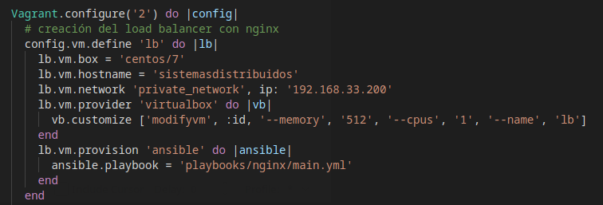

# DOCUMENTATION OF ICESI HEALTH
Authors:
  - Santiago Chasqui Córdoba - A00347050
  - Nicolas Salazar - A00348466
  - Sebastian Rebolledo Meneses - A00310476
  - Paola Veloza Naranjo - A00349107

___
## THE SYSTEM

**Figure 1.** -  System architecture
  
 ## Reverse proxy 
 Initially, a file call Vagrantfile is created where through IaC deploy a server call load balancer with the features below. This load balancer was create with nginx and this is configure with ansible like management of configuration. And in file main.yml configured all dependencies to create this server nginx.
  
 After, when you end all configurations (continue reading) the browser throws a warning, notifing the certificate is not validated, then the load balancer redirect the request http to https, user ommiting the warning of certificate.
! 

 ## Web Servers
 TODO
 ## Storage (DS and DB)
 TODO

 ## Branchind strategy
 