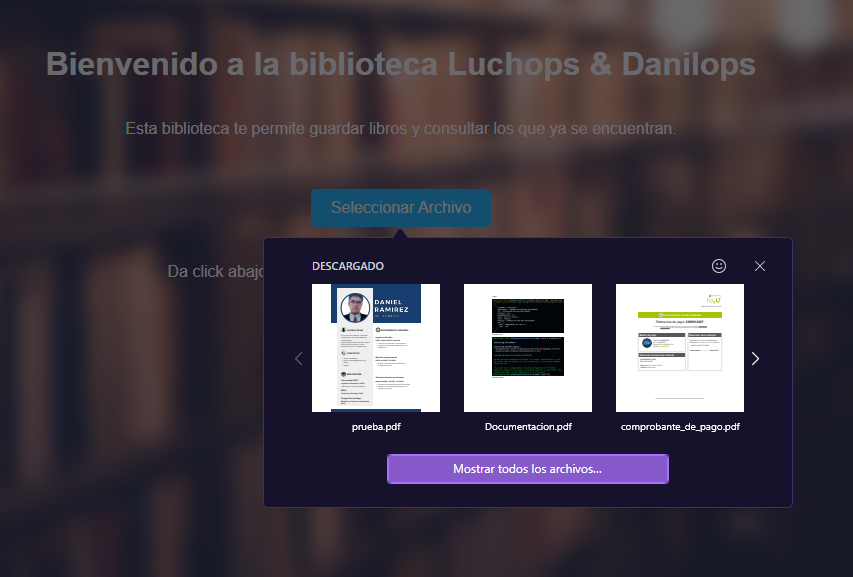
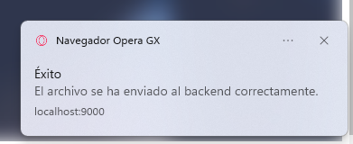
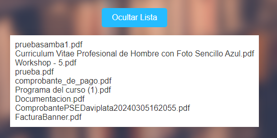
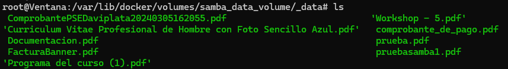
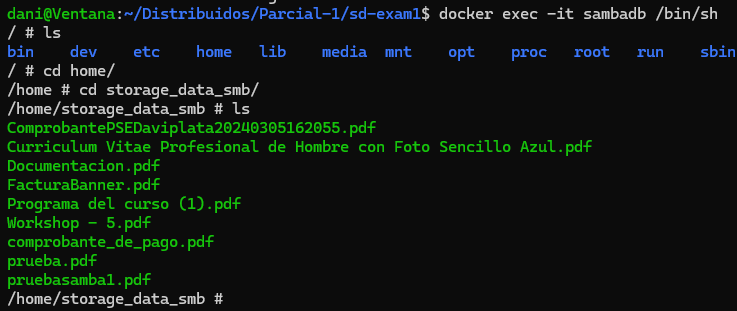
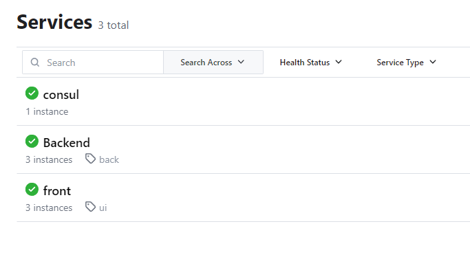
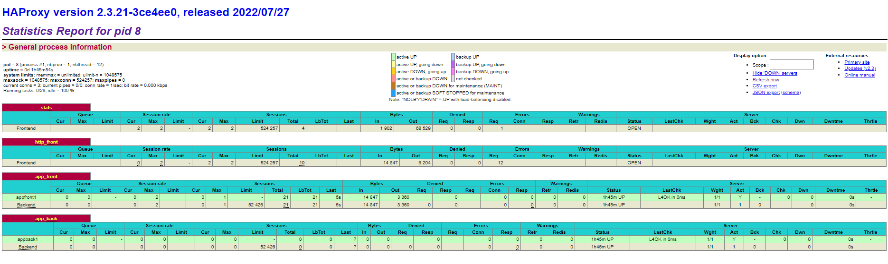

# 📖 Luchops & Danilops library 📖

<p align="center">
  
</p>

# Explanation of the application 🤓

This is a full-stack application (front-end, back-end, and database) where we put all our knowledge about container deployment, microservice discovery like Consul, load balancing like HAProxy, and finally the API gateway for traffic redirection. The application consists of a simple library where clients can save and list PDF files. Development tools such as VS Code, a Windows subsystem based on Linux (WSL), and Docker Desktop, which provides the Docker daemon for analyzing current processes and images, were used. We also demonstrate knowledge in docker-compose and scripting for automatically deploying the environment, and of course, Linux expertise.

### Prerequisites

- Docker installed on your VM (or WSL)
- Docker desktop (if u have WSL)
- Visual studio code
- Clone the repository https://github.com/luis486/sd-exam1.git .

# BRANCH STRATEGY 🪵

## Summary

This part provides a detailed description of the integration tasks carried out during the project development, along with the branching strategy employed to manage different features and software versions.

## Branching Strategy

1. Master Branch

The master branch is considered the main and stable branch of the repository. It only contains verified versions ready for production. Updating this branch occurs only after comprehensive testing on the develop branch.

2. Develop Branch

The develop branch serves as the main integration branch. It is the consolidation branch for all features developed in feature branches. Each time a feature is completed and individually tested, it is merged into the develop branch.

3. Feature Branches

Feature branches (feature/\*) are created to develop new functionalities or enhance specific parts of the system. Each feature branch is derived from the develop branch and is merged back into develop once the functionality is completed and tested.

## Integration Tasks

1. Frontend Development (feature/frontend-improvements)

Creation of the feature/frontend-improvements branch from develop.
Development and testing of frontend improvements.
Integration of feature/frontend-improvements into develop.

2. Backend Development (feature/backend-updates)

Creation of the feature/backend-updates branch from develop.
Development and testing of backend updates.
Integration of feature/backend-updates into develop.

3. Containerization Integration (feature/containerization)

Creation of the feature/containerization branch from develop.
Development and testing of containerization integration.
Integration of feature/containerization into develop.

4. Production Deployment

Final testing on the develop branch.
Merge develop into master for production deployment.
Evidence: Commit on the master branch showing the merge of develop.

## Conclusion

The branching strategy employed facilitates collaboration in the independent development, testing, and integration of features. The documentation and evidence ensure a clear tracking of tasks performed and decisions made during the development and integration process.

# API GATEWAY 📞

#### To authorization

This guide will walk you through the steps to set up an Express Gateway for a partial exam.

## Docker Commands

### Step 1: Run Redis Container

You need first go to the appgw folder yo execute the next command

    docker run --network network_name -d --name container_name -p 6379:6379 redis:alpine

Replace `container_name` with the name you want to give to your Docker container.

Replace `network_name` with the name of your network (you need tha netwkor to connect all containers)

This command starts a Redis container, and in our case, named eg-data-store-parcial on the libraryapp network, exposing port 6379.

### Step 2: Run Express Gateway Container

    docker run -d --name container_name --network network_name -v .:/var/lib/eg -p 8080:8080 -p 9876:9876 express-gateway

This command starts an Express Gateway container, in our case named eg-parcial on the libraryapp network, mapping ports 8080 and 9876, and mounting the current directory as a volume.

Gateway Configuration

### Step 3: Create Users and Credentials

Note: This step is optional, is juts with the purpose of adding security in your data searchs

For that, you need to enter to the container and run the following commands

    docker exec -it container_name sh

Replace `container_name` with the name that you give to your gateway container

    eg users create

This is going to ask you about some data, you need to fulfill that and then execute the next command to have the access token of your api gateway

    eg credentials create -c username -t key-auth -q → 26uJ8uy9m4KVr5Xyk7AM71:1Shi9JNA3Uz8WC3yGdi3tB

Example:

    eg credentials create -c luchops -t key-auth -q → 19dPWIGxRLGpl0FpeMtdQw:0rrrJle54rPdNsuZAOniNS

These commands are executed inside the eg-parcial container's shell. They create users and generate API key credentials for authentication.

Testing the Gateway

### Step 4: Make a Request

    curl -H "Authorization: apiKey 19dPWIGxRLGpl0FpeMtdQw:0rrrJle54rPdNsuZAOniNS" http://localhost:5173

This command sends a curl request to the Express Gateway at http://localhost:5173 using the generated API key for authorization.

# LOAD BALANCER ⚖️

### Container Configuration

1. Open a terminal and navigate to the haproxy directory.
2. Open the `Dockerfile` in a text editor.
3. Ensure that the Dockerfile contains the following:

   ```Dockerfile
    FROM haproxy:2.3
    COPY haproxy.cfg /usr/local/etc/haproxy/haproxy.cfg
   ```

4. Save the Dockerfile.

### Building and Running the Container

1.  Execute the next command in the haproxy directory

        docker build -t image_docker .

    example: docker build -t loadbalancer .

    Replace `image_name` with the name you want to give to your Docker image.

2.  Execute the next command to build the container and run it

        docker run -d -p 9000:80 -p 1936:1936 --network network_name --name container_name image_name

    Replace `container_name` with the name you want to give to your Docker container.

    Replace `image_name` with the name you want to give to your Docker image.

    Replace `network_name` with the name of your network (you need tha netwkor to connect all containers)

example:

    docker run -d -p 9000:80 -p 1936:1936 --network libraryapp --name loadbalancer loadbalancer-parcial

## Testing

If you want to test you can do the next steps

1.  Enter this url into your browser

        http://localhost:1936

    You are going yo see the statics report of the haproxy

# CONSUL 🎯

1.  Open a terminal and enter the next command:

        docker run -d -p 8500:8500 -p 8600:8600/udp --network network_name --name container_name  consul:1.15 agent -server -bootstrap-expect 1 -ui -data-dir /tmp -client=0.0.0.0

    Replace `container_name` with the name you want to give to your Docker container.

    Replace `network_name` with the name of your network (you need tha netwkor to connect all containers)

# SAMBA AND DOCKER VOLUME 🗳️

### Development and Production Environment Setup Guide

This guide will help you set up and containerize the samba connected with a docker volume of our application using Docker. Make sure to follow each step carefully to achieve a stable development and production environment.

### Container Configuration

1. Open a terminal and navigate to the samba directory.
2. Open the `Dockerfile` in a text editor.
3. Ensure that the Dockerfile contains the following:

   ```Dockerfile

    FROM dperson/samba:latest

    COPY smb.conf /etc/samba/smb.conf
    COPY entrypoint.sh /entrypoint.sh

    # Comprueba si la carpeta compartida existe antes de crearla
    RUN test -d /home/storage_data_smb || mkdir -p /home/storage_data_smb
    RUN chmod -R 777 /home/storage_data_smb

    RUN chmod +x /entrypoint.sh

    EXPOSE 139 445

    ENTRYPOINT ["/entrypoint.sh"]

   ```

4. Save the Dockerfile.
5. If you wish to make any changes to `smb.conf` you can change the configuration in which a specific user name is given permission and a path is given to a folder to save files for samba.

   ```smb.conf
    [centralized_storage]
    comment = Shared directory
    path = /home/storage_data_smb
    browsable = yes
    guest ok = yes
    valid users = @backend_user
    read only = no
   ```

### Building and Running the Container

1.  Open a terminal in the samba project directory.
2.  Run the following command to build the container image:

    docker build -t image_docker .

    example: docker build -t sambadb .

    (if you have extension Docker in Visual Studio Code, right-click in Dockerfile and build image)

    Replace `image_name` with the name you want to give to your Docker image.

3.  Now a Docker volume unit will be created with the following command:

        docker volume create name_volume

        example: docker volume create sambaVolume

    Replace `name_volume` with the name you want to give to your Docker Volume

4.  Once the image is successfully built, run the following command to run the container:

        docker run -dit -p 139:139 -p 445:445 --name container_name --network network_name -v name_volume:path_in_samba image_name

        docker run -dit -p 445:445 --name sambadb --network libraryapp -v sambaVolume:/home/storage_data_smb sambadb

    Replace `container_name` with the name you want to give to your Docker container.

    Replace `image_name` with the name you want to give to your Docker image.

    Replace `network_name` with the name of your network (you need tha netwkor to connect all containers)

    Replace `name_volume` with the name that you have been created in the Docker Volume

    Replace `path_in_samba` with the path that you defined in the `smb.conf` and samba Docker File

5.  Now, you need to enter into the samba container, run in cmd

        docker exec -it container_name bash

    Replace `container_name` with the name you want to give to your Docker container.

6.  Enter the next commands in the container

    ```
    bash-5.0# adduser user_name
    bash-5.0# smbpasswd -a user_name
    ```

    Replace `user_name` with the username that you defined in the smb.conf.

    In which command the system is going to ask you for a password, we recommend to you to have the same password in each one.

## Testing

If you want to test you can do the next steps

1.  You need to know what is the IP of your samba container, for that you can use

        docker inspect -f '{{range .NetworkSettings.Networks}}{{.IPAddress}}{{end}}' container_name

        example: docker inspect -f '{{range .NetworkSettings.Networks}}{{.IPAddress}}{{end}}' sambadb

    Replace `container_name` with the name you want to give to your Docker container.

2.  With the ip, you can use the next command

        smbclient //DOCKER_HOST_IP/centralized_storage -U user_name

        example: smbclient //172.20.0.2/centralized_storage -U backend_user

        If u dont have smbclient, install:

        sudo apt install smbclient

    Replace `user_name` with the username that you defined in the smb.conf.

    Replace `DOCKER_HOST_IP` with the ip of the samba container

3.  You need the password that you have been created in the container configuration, if is succesfull, you have access to the path of the samba and you can list or do what you want without access problems

# BACKEND 🗿

### Development and Production Environment Setup Guide

This guide will help you set up and containerize the backend of our application using Docker. Make sure to follow each step carefully to achieve a stable development and production environment.

### Container Configuration

1. Open a terminal and navigate to the backend directory.
2. Open the `Dockerfile` in a text editor.
3. Ensure that the Dockerfile contains the following:

   ```Dockerfile
    # Usa una imagen base de Python
    # Use an image based in Python
    FROM python:3.8-slim

    # Set the work dir
    WORKDIR /app

    # Copy the files of the application in the container
    COPY . .

    # Install the dependency
    RUN pip install --no-cache-dir -r requirements.txt

    # Expose the flask application port
    EXPOSE 5000

    # Command to execute the flask application
    CMD ["python", "app.py"]
   ```

   The requirements in this case, are in a text file called requirements.txt, if you want to add more, you can modify this file:

   ```requirements.txt
    blinker==1.7.0
    click==8.1.7
    Flask==3.0.2
    Flask-Cors==4.0.0
    itsdangerous==2.1.2
    Jinja2==3.1.3
    MarkupSafe==2.1.5
    pyasn1==0.5.1
    pysmb==1.2.9.1
    tqdm==4.66.2
    Werkzeug==3.0.1
   ```

4. Save the Dockerfile.

### Building and Running the Container

1.  Open a terminal in the backend project directory.
2.  Run the following command to build the container image:

    docker build -t image_docker .
    (if you have extension Docker in Visual Studio Code, right-click in Dockerfile and build image)

    Replace `image_name` with the name you want to give to your Docker image.

3.  Once the image is successfully built, run the following command to run the container:

        docker run -dit -p 5000:5000 --name container_name --network network_name image_name

        example: docker run -d -p 5000:5000 --network libraryapp --name backendparcial backendparcial

    Replace `container_name` with the name you want to give to your Docker container.

    Replace `image_name` with the name you want to give to your Docker image.

    Replace `network_name` with the name of your network (you need tha netwkor to connect all containers)

## Testing

If you want to test, he backend has two HTTP request, POST and GET, for testing this you can:

### POST

In a cmd you can enter the next command.

     curl -X POST -F "file=enter/your/pdf/path" http://127.0.0.1:5000/upload

Replace `enter/your/pdf/path` with the path of the pdf that you want to store

### GET

In a cmd you can enter the next command.

     curl http://127.0.0.1:5000/get_pdf_list

# FRONTEND 🪟

## Development and Production Environment Setup Guide

This guide will help you set up and containerize the frontend of our application (Library App) using Docker. Make sure to follow each step carefully to achieve a stable development and production environment.

### Steps to Follow

1. Open a terminal and navigate to the frontend project directory.
2. To view this app in localhost:

- Change directory to the library-app folder _cd/frontend-project/library-app_
- npm install (to install libraries to your project)
- npm run dev (to "deploy" locally)

### Container Configuration

1. Open the `Dockerfile` in a text editor.
2. Ensure that the Dockerfile contains the following:

   ```Dockerfile
    FROM node:18 AS build WORKDIR /app

    COPY package.json package-lock.json ./

    RUN npm install

    COPY . .

    EXPOSE 5173

    RUN npm run build

    Stage 2

    FROM nginx:alpine ADD ./config/default.conf /etc/nginx/conf.d/default.conf

    COPY --from=build /app/dist /var/www/app/

    COPY consul.sh /consul.sh

    RUN chmod +x /consul.sh

    EXPOSE 80

    CMD ["/consul.sh"]
   ```

3. Save the Dockerfile.

### Building and Running the Container

1.  Open a terminal in the frontend project directory.
2.  Run the following command to build the container image:

         docker build -t image_docker .

    (if you have extension Docker in Visual Studio Code, right-click in Dockerfile and build image)

    Replace `image_name` with the name you want to give to your Docker image.

3.  Once the image is successfully built, run the following command to run the container:

          docker run -d -p 5173:5173 --network network_name --name container_name image_name

    example: docker run -d -p 5173:5173 --network libraryapp --name frontendparcial frontendparcial

Replace `container_name` with the name you want to give to your Docker container.

    Replace `container_name` with the name you want to give to your Docker container.

    Replace `image_name` with the name you want to give to your Docker image.

    Replace `network_name` with the name of your network (you need tha netwkor to connect all containers)

    This will run the container and make it accessible at `http://localhost:5173` in your web browser.

You now have the development environment set up and running on your machine.

## Production Environment Setup

### Steps to Follow

1. Follow the same container configuration steps as described in the development section.
2. Make sure to use the built image for production (`image_name`) when running the container on your production server.

# Evidence of performance ✏️

First, we can appreciate the web page designed with reac + vite.

<p align="center">
  
</p>

If we click on the select file button, we can see that it loads the interface that the browser uses to upload a file, the program will check if it is a pdf and if it is, it will activate the save file button plus a button to send to the backend.

<p align="center">
  
</p>

<p align="center">
  
</p>

Then, the file will be sent to the backend.

<p align="center">
  
</p>

We can list the files that are in the docker volume and in samba.

<p align="center">
  
</p>

We can see that this is added in samba and also in the docker volume.

<p align="center">
  
</p>

<p align="center">
  
</p>

Finally, we can see the operation of the consul and the load balancer.

<p align="center">
  
</p>

<p align="center">
  
</p>

# Problems in the development 💀

## Problem # 1

The user in samba did not have permissions to modify anything inside the folder in which it was stored in samba, as a result, when the user tried to save something inside samba, the system rejected the request.

### Solution

The backend user was given super permissions and the samba configuration was changed to store the passwords in a samba configuration file.

## Problem # 2

The consul was registering the consul but it was marking the backend health section as "x".

### Solution

At first we did not understand why this was happening, but then analyzing the frontend, we saw that it was using the 200 response that the frontend gave, which the backend did not have, so we proceeded to create an endpoint for the backend and it finally passed the test.

## Problem # 3

One of the members of the group could not upload the samba container because port 445 was being occupied by the native windows machine.

### Solution

Here there are two possible solutions found, change the samba port and map it to another port on the native system and the second one which is to find the service that uses the port and try to stop it but this gave us problems so we are still looking for more about this second solution.

# Things to improve 🛠️

One of the things to improve would be to add a DNS service to stop querying everything by localhost and to make use of the names of the services.

If we had more time, we would invest in the front end, improving its graphical aspect mainly, the color palette, the way in which the user navigates in the front end, etc.

And finally, as a team, we believe that this project lacks a database to have the records of what is stored in samba.

# Project Members 😎

- **Luis Murcia - A00369008**
  - GitHub: [Luchops](https://github.com/luis486)
- **Daniel Ramirez - A00368788**
  - GitHub: [Danilops](https://github.com/DanielRamirez1901)
