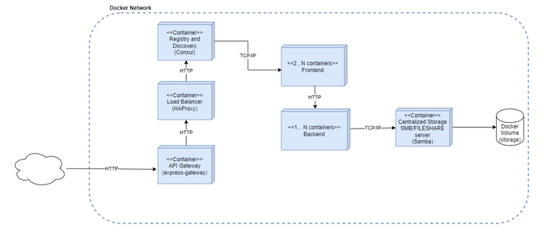

## Business case

This particular business case is focused on creating a web application that allows managing the upload of images by users who use Instagram services, where they asked us to create a solution with the tools that Docker offers. The following diagram describes the deployment and how the development of the solution is carried out.



Team:
- Cesar Canales A00345025
- Ana Maria Munoz A00354233
- Nelson Quinonez A00351918

# Docker images pull

We bring some necessary images for the deployment

```
docker pull consul
```

```
docker pull redis:alpine
```

```
docker pull express-gateway
```

```
docker pull dperson/samba
```

# Docker Network
We create a docker Network where all the containers will interact with each other

```
docker network create redcita
```

# BACK

The first docker container we are going to deploy is the back end app where the app saves the images and stores them in a share volume with a samba container, that is the reason why you have to also install samba package in the container, this change is done in the Dockerfile.

Remeber to execute the docker build command insed the back folder.

```
docker build -t backapp ./back/
```

We need to run the container inside the previusly created network redcita.

```
docker run -d -p 5010:5010 --network redcita --name backapp backapp
```

# Consul

This container is necessary to perform service descovery and as a dns table for the microservices containers.

That dns table will help the load balancer perform its functions.

```
docker run -d -p 8500:8500 -p 8600:8600/udp --network redcita --name consul consul:latest agent -server -bootstrap-expect 1 -ui -data-dir /tmp -client=0.0.0.0
```

# Load balancer

The load balancer is the one in charge of distributing network or application traffic across a number of containers.

In our case we are working with multiple instances of the container with the front application, and the load balancer decides which instance the user should use.

The configuration of the load balancer is inside the haproxy folder in haproxy.cfg file.

```
docker build -t loadbalancer ./haproxy/

docker run  -p 80:80\
            -p 1936:1936 \
            --network redcita \
            --name loadbalancer \
            -d \
            loadbalancer
```

# Application gateway

1. In order to use Identity features, we need to have a data storage like Redis, that is a database.

```
docker run --network redcita -d --name express-gateway-data-store \
                -p 6379:6379 \
                redis:alpine
```

2. Start the Express-Gateway instance
Run the command inside appgw directory o keep in mind change the volume path to pointing to gateway.config.yml

```
cd appgw
```

```
docker run -d --name express-gateway \
    --network redcita \
    -v $PWD:/var/lib/eg \
    -p 8080:8080 \
    -p 9876:9876 \
    express-gateway
```

# FRONT

We execute two instances of the frontapp to test load balancing capabilities.
In the front app we visualize the images that we have saved int the "/" path. If we want to save an in image we go to the "/upload-image" path.

```
docker build -t frontapp ./front/

docker run -d -p 5000:5000 --network redcita --name frontapp1 frontapp

docker run -d -p 5001:5000 --network redcita --name frontapp2 frontapp
```

# SAMBA

Create a folder named sambaconfig where you can store a Samba config file

For example:
```
/home/nelson/Desktop/sd-exam1/sambaconfig
```

Now, you have to create the Samba config file that is going to be create in the previous folder.

#Content of the Samba config file smb.conf

```
[global]
workgroup = SAMBA
security = user
passdb backend = tdbsam
printing = bsd
printcap name = /dev/null

[homes]
comment = Home Directories
valid users = %S, %D%w%S
browseable = No
read only = No
inherit acls = Yes

[share]
path = /usr/local/share
browsable = yes
public = yes
writeable = yes
```

Finally, create a folder that will have the volume where images are stored in the machine where the samba container is running

For example:
```
/usr/local/docker/samba/share
```

# Execute samba

When executing samba, remember that next to the first --volume you have to put the path where sambaconfig folder is saved. And, next to the second --volume you have to put the path of the folder where the volume that stores the images is saved.

```
docker run --network redcita --detach --publish 139:139 --publish 445:445 --volume /home/nelso/Desktop/exam1/sd-exam1/sambaconfig:/etc/samba --volume /usr/local/docker/samba/share:/usr/local/share --restart unless-stopped --name samba dperson/samba
```

# Enter samba bash

We need to change the permissions in the folder where the images are going to be saved.

```
docker exec -it samba bash
//Enter the folder where the share folder is located
cd /usr/local
chmod 777 share
```

To test conectivity with the samba server 

smbclient --list //127.0.0.1/share --user extuser

smbclient //127.0.0.1/share -U extuser

Using your local linux user you can put manually a file in the samba server.

smbclient //127.0.0.1/share %password . -c 'put testing testing'

smbclient //samba/share % -c 'put testing testing2'
